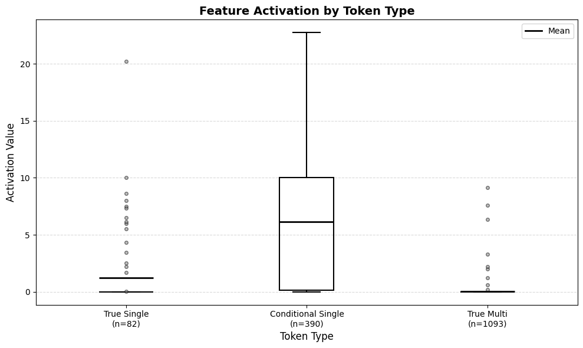
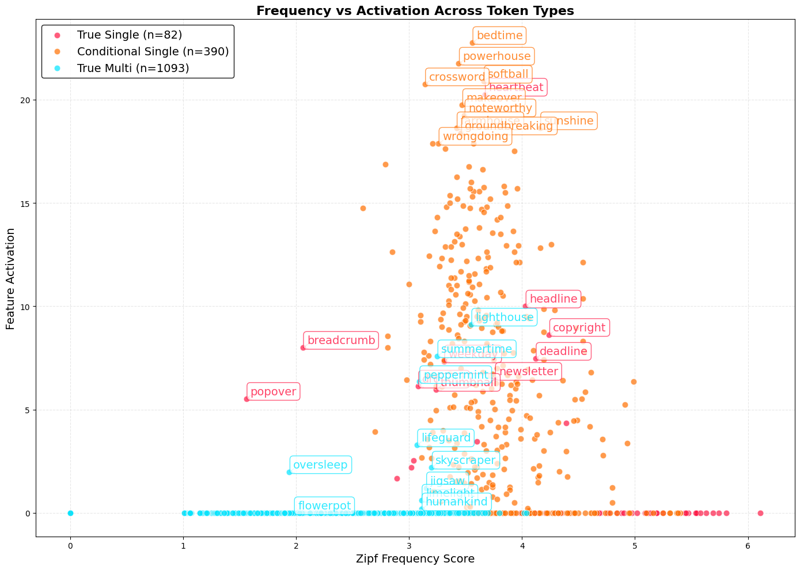

# Signs of tokenization awareness in Qwen3-4B

I discovered a group of features in the early layers of the Qwen3-4B transcoder that fire on English compound words with unstable tokenization pattern (in some context, the compound is represented with one token, and in different context with two). The existence of such features sheds light on both token merging quirks and the detokenization mechanism in the early LLM layers.

```
Single-token compounds:
newsletter    →  newsletter          
_newsletter   →  _newsletter

Multi-token compounds:
sunflower    →  sun · flower
_sunflower    → _sun · flower

Compounds with unstable tokenization:
firefighter  →  fire · fighter
_firefighter →  _firefighter

```

📄 **[Read the write-up](https://solidgoldmagikarp.github.io/tokenization-awareness/)** ·
🔬 **[Feature on Neuronpedia](https://www.neuronpedia.org/qwen3-4b/0-transcoder-hp/118230)** ·
✍️ **[Original post on Medium](https://medium.com/@solidgoldmagikarp/a-breakthrough-feature-signs-of-tokenization-awareness-in-llms-058fe880ef9f)**

---

## Method

I measured activation of one Qwen3-4B's L0 feature on a dataset of 1,566 closed compounds, grouped by how Qwen3-4B's BPE tokenizer treats them
with and without a leading space. Activations were measured on the space-prefixed form of every compound. In case of multi-token compounds, the reading was taken at the last token position. The hook point was `blocks.0.ln2.hook_normalized`**: the layer-normalisedresidual stream entering the MLP.

## Results

| Group | Example | With space | Without | n | Mean activation |
|---|---|---|---|---:|---:|
| **Single-token** | `newsletter` | 1 token | 1 token | 82 | 1.22 |
| **Unstable** | `firefighter` | 1 token | 2 tokens | 390 | **6.13** |
| **Multi-token** | `sunflower` | 2 tokens | 2 tokens | 1,093 | 0.03 |

All three pairwise differences were significant (p < 1e-13). The conditional group's mean is 5× the true-single group's and 200× the true-multi group's.



The correlation between the word frequency and the feature activation reminded normal distribution: the activation values spiked in the middle of the frequency range. This is another piece of evidence that the feature represents a specific tokenization (token merging) pattern rather than some grammar structure or meaning. 

In a natural text, the words are normally divided by whitespaces, so words with a leading whitespace are more frequent in the corpus. As a result, for the medium-frequent compounds the tokens with a leading whitespace get merged, while the tokens without a whitespace stay unmerged. Since the model has to reconstruct the meaning of words from tokens (detokenize the concepts), it implicitly learns the tokenization patters, and becomes meta-aware of its own tokenizer.




## Limitations

- This is a case study, mostly done on one model and one feature.
- Transcoders only capture the MLP layers and leave out the attention layers that may be responsible for processing multi-token concepts.
- The tokenizer is open-source and might leak to the training data.
- The dataset consisted of English compounds only.
- No ablation or causal intervention experiments were conducted.

Full results:
**[results/reference_run/RESULTS.md](results/reference_run/RESULTS.md)**

## Install

```bash
git clone https://github.com/solidgoldmagikarp/tokenization-awareness.git
cd tokenization-awareness
pip install -e .            # dataset + analysis, CPU only
pip install -e ".[model]"   # adds torch + TransformerLens for the measurement stage
```

Python 3.10+. The measurement stage wants ~9 GB of VRAM for Qwen3-4B in bfloat16.

## Run

The pipeline includes three stages, each writing a file the next one reads, so the GPU step happens once and the analysis can be re-run many times.

```bash
python scripts/build_dataset.py        # → results/groups.json         (seconds, CPU)
python scripts/measure_activations.py  # → results/activations.json    (~15 min, GPU)
python scripts/analyze.py              # → statistics + results/figures/
```

Same experiment with capitalized compounds:

```bash
python scripts/capitalization.py       # → results/capitalization.json
python scripts/build_page_data.py      # → docs/assets/tokens.js, for the write-up
```

Useful flags:

```bash
python scripts/measure_activations.py --feature 12345 # point at a different feature
python scripts/analyze.py --equal-var                 # reproduce the original t-tests
```

## Using it as a library

```python
from tokenization_awareness import build_groups, load_compounds
from tokenization_awareness.dataset import load_tokenizer

tokenizer = load_tokenizer()
groups = build_groups(tokenizer, load_compounds())

print(groups.summary())
print(groups.conditional_single[:5])
# ['nevertheless', 'newborn', 'afternoon', 'newcomer', 'folklore']
print(groups.spaced("conditional_single")[:2])
# [' nevertheless', ' newborn']
```

```python
from tokenization_awareness.activations import load_model, measure_activations
from tokenization_awareness.transcoder import load_transcoder

model = load_model()
transcoder = load_transcoder(layer=0)
measure_activations(model, transcoder, [" firefighter", " sunflower"])
```

## Layout

```
tokenization_awareness/
    config.py        model, transcoder, feature index, paths
    dataset.py       word list → the three tokenization groups
    transcoder.py    load transcoder weights; encode MLP inputs to features
    activations.py   run the model, read one feature at the last token
    analysis.py      descriptive stats, t-tests, firing words, Zipf correlations
    plots.py         the two figures
scripts/             the pipeline stages, each with a CLI
data/compounds.txt   1,720 English compounds
results/             regenerated outputs; reference_run/ is committed
notebooks/           the original Colab notebook, unmodified
tests/               pytest suite
docs/                the write-up, served as a GitHub Page
```

## Tests

```bash
pip install -e ".[dev]"
pytest                  # 20 tests
pytest -m "not slow"    # skip the ones that download the tokenizer
```

## Credits

Compound word list from
[proofreadingservices.com](https://www.proofreadingservices.com/pages/compound-words-list).
Transcoders by [Michael Hanna](https://huggingface.co/mwhanna/qwen3-4b-transcoders).
Feature exploration via [Neuronpedia](https://www.neuronpedia.org/)'s Circuit
Tracer. Hooks by [TransformerLens](https://github.com/TransformerLensOrg/TransformerLens).
Frequency scores by [wordfreq](https://doi.org/10.5281/zenodo.7199437).

Written as a research proposal for Neel Nanda's MATS stream, Summer 2026.

MIT licensed.
